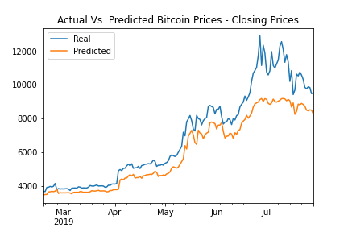

# Long Short-Term Memory (LSTM) Cryptocurrency Model

A LSTM model is a recurrent neural network (RNN) used for time series data with long time windows.  The LSTM-RNN predicts which values it needs to "remember" as it runs, allowing it to use data from long time periods without being overwhelmed with extraneous data.  

In this repository, I have used two datasets to build two LSTM models.  Both data sets contain information about Bitcoin.  One data set contains historic Fear & Greed Index values and the other data set contains historic closing price data.

The Crypto Fear & Greed Index uses sentiment analysis from several data sources to score current feelings about Bitcoin and other large cryptocurrencies.  From [the Crypto Fear & Greed Index site](https://alternative.me/crypto/fear-and-greed-index/):

> The crypto market behaviour is very emotional. People tend to get greedy when the market is rising which results in FOMO (Fear of missing out). Also, people often sell their coins in irrational reaction of seeing red numbers. With our Fear and Greed Index, we try to save you from your own emotional overreactions. There are two simple assumptions:

>* Extreme fear can be a sign that investors are too worried. That could be a buying opportunity.
>* When Investors are getting too greedy, that means the market is due for a correction.

>Therefore, we analyze the current sentiment of the Bitcoin market and crunch the numbers into a simple meter from 0 to 100. Zero means "Extreme Fear", while 100 means "Extreme Greed". See below for further information on our data sources.

The closing price data set is exactly what it sounds like - closing prices for Bitcoin over time.  In both LSTM models, the data sets are imported into Pandas and joined together.  For the FNG Predictor file, the FNG values are used as the features data.  For the Closing Predictor file, the closing prices are used as the features data.

## Results

I found that the LSTM model was not a very good fit when using the FNG index as the features data.  The mean squared error (MSE) is 0.3021 and the model appears to be overfitting the data:

When the closing prices were used as the features data, the LSTM model performs well.  The MSE 0.0101, and the model appears to be a good a fit for the data:

